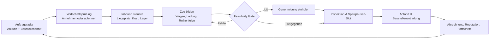

# Game Design Document: **Schwerlast-Terminal Deutschland**

**Version:** 1.0  
**Stand:** 27. August 2026  
**Autor:** Manus AI

## 1. Vision, Genre und Designversprechen

**Schwerlast-Terminal Deutschland** ist eine persistente Browser-Wirtschaftssimulation über ein deutsches Intermodal-Terminal für außergewöhnliche Industrie- und Baugleis-Logistik. Der Spieler steuert keinen allgemeinen Güterverkehr, keine Pakete und keinen Personenverkehr. Er verantwortet die kritische Schnittstelle zwischen Schiff, Frachtflugzeug, Terminal und speziell formiertem Bauzug. Das Spielgefühl ist deshalb nicht „möglichst viel transportieren“, sondern **knappe Infrastruktur unter Zeitdruck in einen sicheren, regelkonformen und profitablen Baufortschritt zu verwandeln**.

> **Designversprechen:** Jede erfolgreiche Abfahrt ist ein sichtbarer Beweis von Planungskompetenz. Der Gewinn entsteht nicht allein durch Volumen, sondern durch die Auflösung realer Engpässe: Hubkraft, Lagerraum, Gleislänge, Wagenzuladung, Lademaßüberschreitung (LÜ), Sperrpausen und Baustellenreihenfolge.

Frachtimperium zeigt eine verständliche operative Trennung von Auftragsbörse, Disposition, Fuhrpark, Werkstatt, Geländeaubau und Kartenübersicht. Seine Aufträge machen Eignung und Wirtschaftlichkeit vor Annahme zur Spielerentscheidung; die Disposition berücksichtigt mehrere Ausführungsschritte. [1] Diese Klarheit wird übernommen, aber auf die schwerlastspezifische Kette zugespitzt. Anno 1800 demonstriert, wie Produktionsketten, Handelsnetze und neue Regionen langfristig miteinander verzahnt werden können. [2] Hier ersetzen **Bauphasen, Infrastrukturfreigaben und Terminalausbauten** die klassische Stadtwachstumsleiter.

| Dimension | Designentscheidung |
|---|---|
| Zielgruppe | Spieler mit Interesse an Wirtschaft, Eisenbahn, Infrastruktur und planungsorientierten Simulationen. |
| Sessionlänge | Zwei bis zehn Minuten für ein operatives Eingreifen; 30 bis 60 Minuten für die Planung eines Großprojekts. |
| Zeitsystem | Tick-basierter Simulationskalender mit planbaren Zeitfenstern; keine harte Echtzeit-Pflicht. |
| Primäre Fantasie | „Ich bin der Terminalleiter, ohne den dieses Bauprojekt nicht beginnen kann.“ |
| Kernspannung | Hohe Vergütung steht gegen knappe Ressourcen und das Risiko, eine Baustellen-Sperrpause zu verlieren. |
| Fail-state | Lokale finanzielle und reputative Rückschläge, aber kein zerstörerischer Reset bei einem einzelnen Fehler. |

## 2. Designprinzipien

Das Spiel folgt fünf Prinzipien. Erstens ist **jede Restriktion lesbar**, bevor sie teuer wird. Ein zu schweres Bauteil, eine fehlende LÜ-Genehmigung oder eine unpassende Wagenreihung dürfen niemals nur als Überraschung am Ende erscheinen. Zweitens bleibt die Komplexität **schichtweise**: Einsteiger disponieren schlüsselfertige Kleinaufträge; fortgeschrittene Spieler komponieren mehrstufige Bauzüge mit Übergaben, Reserven und Sondergenehmigungen.

Drittens wird wirtschaftliche Präzision honoriert. Spieler dürfen mit Puffer planen, aber der höchste Deckungsbeitrag entsteht, wenn Liegezeit, Leerfahrten, Lagerumschlag und Zuglänge klug reduziert werden. Viertens erhalten infrastrukturelle Investitionen einen nachvollziehbaren kausalen Nutzen. Ein stärkerer Kran erschließt nicht einfach „Stufe 2“, sondern ermöglicht tatsächlich den Umschlag eines 240-t-Trafogehäuses. Fünftens ist **Baufortschritt sichtbar**: Jede korrekt gelieferte Reihenfolge verändert die Baustellenansicht und erzeugt eine klare Rückkopplung zwischen Terminalentscheidung und gebauter Infrastruktur.

| Prinzip | Spielerregel | Systemische Konsequenz |
|---|---|---|
| Sichtbare Validierung | „Was scheitert, sehe ich vorher.“ | Live-Prüfung direkt in Listen, Drag-and-Drop-Zugbildung und Bestätigungsansicht. |
| Engpass statt Mengeninflation | „Die knappe Ressource bestimmt den Plan.“ | Kapazitäts-, Zeitfenster- und Genehmigungskonflikte strukturieren Aufträge. |
| Ergebnisorientierte Tiefe | „Ein Bauzug ist ein konkretes Projekt, kein abstrakter Auftrag.“ | Lieferreihenfolge und Bauphasen beeinflussen Erlös, Termin und Reputation. |
| Reversible Lernkurve | „Fehler kosten, aber zerstören nicht.“ | Entwurfsmodus, Umplanung vor Abfahrt, Teilrettung und gestaffelte Straflogik. |
| Operatives Gedächtnis | „Ich kann Entscheidungen nachvollziehen.“ | Zugakte, Ereignisprotokoll und Vertragsarchiv erklären jeden Betrag und jeden Status. |

## 3. Kernschleife

Die Kernschleife beginnt mit dem **Auftragsradar**. Es bündelt ankommende Schiffs- und Luftfrachten, Baustellenabrufe, Vertragsfristen sowie verfügbare Sperrpausen. Der Spieler nimmt entweder einen einzelnen Umschlag an oder schließt einen Projektvertrag, der mehrere gestaffelte Abrufe umfasst. Vor Zusage sieht er den erwarteten Umsatz, das früheste Fertigstellungsdatum, den erforderlichen Kran, die benötigte Lagerfläche und die prognostizierte Zuglänge.

Nach der Annahme trifft die Fracht ein. Der Spieler weist Liegeplatz, Kranzeit und Lagerzone zu. Bei der Umladung erfolgt die erste harte Regelprüfung: Überschreitet das Gut die Krantragfähigkeit, ist der Vorgang nicht buchbar. Lagerung ist kein passiver Zwischenschritt: Fläche, Blockierwirkung, Versicherungswert und Tageskosten erhöhen sich mit jedem wartenden Gut.

Der entscheidende Spielmoment ist die **Zugbildung**. Der Spieler reserviert geeignete Wagen, belädt sie, reiht sie auf dem Baugleis und hält eine realistische Nutzlänge ein. Die Reihenfolge ist keine kosmetische Position: Die Baustelle fordert beispielsweise erst Schotter, danach Schwellen, dann Schienen und anschließend Brücken- oder Oberleitungsbauteile. LÜ-Güter erzeugen einen Genehmigungsprozess, der entweder Zeit kostet oder mit einem kostenpflichtigen Expressverfahren beschleunigt werden kann. Erst ein fehlerfreier Zug kann in die Inspektion und anschließend in die Sperrpause disponiert werden.

Nach Abfahrt wird das Ergebnis über Pünktlichkeit, Vollständigkeit, Reihenfolge, Aufwand und Sicherheit abgerechnet. Die Erlöse fließen in Liquidität, Reputation, projektbezogene Erfahrungswerte und eventuell neue Rahmenverträge. Das daraus entstehende Kapital beseitigt den nächsten relevanten Engpass: zusätzlicher Gleisanschluss, größere Kranbahn, Spezialwagenbestand, Spezialisten oder ein zweites Terminalmodul.

| Schleifenphase | Entscheidung des Spielers | Primäre Kennzahl | Typisches Risiko | Sofortige Rückkopplung |
|---|---|---|---|---|
| Auftragsradar | Welchen Auftrag bzw. Vertrag binde ich? | Deckungsbeitrag nach Risikopuffer | Kapitalbindung, falscher Ressourcenzugriff | Ampel-Prognose für Marge und Frist. |
| Inbound | Wie löse ich Umschlag und Lagerung? | Kranstunden, Lagerauslastung | Überlastung, Liegegeld, Kranlimit | Terminalkarte zeigt blockierte Flächen und Slot-Konflikte. |
| Zugbildung | Welche Wagen, Ladungen und Reihenfolge? | Nutzlänge, Zuladungsreserve, Reihenfolgescore | LÜ, Überladung, falsche Entladereihe | Zugeditor validiert jede Änderung. |
| Freigabe | Wann fährt der Zug? | Pünktlichkeitsreserve | verlorene Sperrpause, fehlende Genehmigung | Checkliste und Risiko-Simulation. |
| Abrechnung | Wie wurde geliefert? | DB, Bonus, Reputation | Strafe, Nacharbeit, Vertragswertverlust | Zugakte erklärt die Ergebnisformel. |

## 4. Wirtschaftssystem

### 4.1 Einnahmen

Die Wirtschaft soll nicht zu einer einzigen Umsatzformel kollabieren. Einnahmen werden deshalb in **operative Entgelte**, **Qualitätsvergütungen** und **strategische Vertragseffekte** getrennt. Der reine Umschlag zahlt die Basisliquidität. Erträge mit höherem Risiko entstehen durch projektkritische Zugbildung, kurz getaktete Sperrpausen und korrekt bewältigte LÜ-Sendungen.

| Einnahmequelle | Auslöser | Berechnungslogik | Spielerischer Zweck |
|---|---|---|---|
| Umschlagentgelt | Schiff/Air Cargo wird regelkonform entladen. | Grundsatz je Tonne bzw. Stück × Schwerlast-/Sonderkranzuschlag. | Frühe, verständliche Liquidität. |
| Lagerentgelt | Kunde nutzt Lagerfläche innerhalb eines vereinbarten Freikontingents. | Belegte m² × Kalendertage × Gefahr-/Wertfaktor. | Auslastung rentabel machen, ohne Überfüllung zu belohnen. |
| Zugbildungsentgelt | Ein Zug wird vollständig und korrekt formiert. | Fixbetrag + Wagenanzahl + Komplexitätszuschlag. | Kernkompetenz monetarisieren. |
| Projektmarge | Baugleis-Lieferung wird geliefert. | Vertragsbasis − variable Kosten − Abzüge. | Größter direkter Fortschrittsmotor. |
| Pünktlichkeitsbonus | Ankunft innerhalb des bevorzugten Zeitfensters. | Anteil der Projektmarge, gedeckelt. | Pufferplanung und aktive Priorisierung honorieren. |
| Sequenzbonus | Baustellenreihenfolge vollständig korrekt. | Fester Qualitätsbonus pro Abruf / Projektmeilenstein. | Reihenfolge als relevante Puzzle-Regel etablieren. |
| LÜ-Kompetenzzuschlag | LÜ-Gut inkl. Genehmigung und Transport geliefert. | Zuschlag abhängig von Schweregrad und Strecke. | Spezialausbau attraktiv machen. |
| Rahmenvertragsbonus | Alle Abrufe eines Vertrags erfüllt. | Meilensteinzahlung + neues Auftragstier. | Langzeitbindung und verlässliche Planung. |

Die zentrale Planungszahl ist der **erwartete Deckungsbeitrag**. In der Auftragsvorschau wird er stets als Bandbreite dargestellt: konservativ bei normaler Genehmigung und kleinem Zeitpuffer, optimistisch bei schneller Freigabe und pünktlicher Sperrpause. Dies verhindert eine falsche Präzision und kommuniziert Risiko transparent.

> **Vorschauformel:** Erwarteter Deckungsbeitrag = Projektmarge + prognostizierte Qualitätsboni + Lagererlöse − Umschlagkosten − Personal- und Trassenkosten − erwartete Liegegebühren − Genehmigungsaufwand − Risikopuffer.

### 4.2 Kosten, Strafen und Risikomanagement

Kosten müssen spürbar, aber eindeutig zurechenbar sein. Frachtimperium beschreibt nachvollziehbare Diesel-, Maut- und Verschleißkalkulationen sowie ein Vertragsarchiv für Boni und Strafen. [1] Das Zielspiel übernimmt die Transparenzregel, ersetzt die Straßentransportkosten aber durch terminal- und eisenbahnspezifische Kostenarten.

| Kosten- bzw. Risikoart | Auslöser | Wirkung | Gegenmaßnahme |
|---|---|---|---|
| Liegegebühr | Schiff/Frachtflugzeug wartet nach Freizeit. | Stündlich steigend; bei Projektfracht stärker. | Kran-Slot freihalten, Ankunft umplanen, Pufferlager vorhalten. |
| Lagerkosten | Fracht blockiert eine Zone. | Tägliche Kosten, zusätzlich Opportunitätskosten durch belegte Fläche. | Just-in-time-Zugbildung, Auslagerung, neue Fläche. |
| Kranbetrieb | Umschlag wird gestartet. | Personal, Energie, Verschleiß pro Hub bzw. Stunde. | Kran passend auslasten, aber nicht überziehen. |
| Zugbereitstellung | Wagen/Lok und Baugleis werden reserviert. | Fixkosten plus Wagen- und Rangieranteil. | Kombination kompatibler Abrufe, um Leerraum zu reduzieren. |
| LÜ-Genehmigung | Lademaßüberschreitung. | Standarddauer oder Expressgebühr. | Vorplanung, Reputation im Spezialsegment, Genehmigungsbüro. |
| Sperrpausenverlust | Zug ist zu spät oder nicht freigegeben. | Hohe Vertragsstrafe, Terminverschiebung, Reputationsverlust. | Checklisten, Zeitreserve, Ersatzslot kaufen/verhandeln. |
| Falsche Reihenfolge | Baustellenreihenfolge wird verletzt. | Teilabnahme, Umrangierkosten, verlorener Sequenzbonus. | Reihenfolgen-Overlay und Entwurfssimulation. |
| Überlastung/Überlänge | Harte technische Grenze verletzt. | Abfahrt wird blockiert, keine stille Teilabnahme. | Live-Validierung, automatische Restkapazitätsanzeige. |

Strafen werden **stufenweise** modelliert. Vor der Abfahrt verhindert das System unzulässige technische Konfigurationen; nach Abfahrt entstehen keine willkürlichen Spielabbrüche. Eine verpasste Sperrpause führt zunächst zu einem Umplanungsvorgang mit Mehrkosten. Erst beim Überschreiten der vertraglichen Nachfrist fällt die Vertragsstrafe an. Dadurch bleibt die Entscheidung anspruchsvoll, ohne den Spieler durch unsichtbare Regeln abzustrafen.

### 4.3 Markt, Verträge und Auftragsqualität

Der Markt hat drei Ebenen. Spotaufträge halten das Terminal beschäftigt und lehren eine einzelne Regel. Projektabrufe verbinden mehrere Güter mit einer konkreten Baustellenphase. Rahmenverträge eröffnen mehrwöchige oder mehrmonatige Bauvorhaben mit Kapazitätsreservierung, Meilensteinen und Vertragswertung. Diese Struktur nutzt die Auftragsklarheit der Frachtbörse als Einstieg, entwickelt daraus aber eine stärker strategische Projektpipeline. [1]

| Marktstufe | Zeitrahmen | Komplexität | Belohnung | Zweck |
|---|---:|---|---|---|
| Spotumschlag | 1–3 Spieltage | Ein Gut, ein Umschlag | Liquidität, geringer Ruf | Tutorial und Kapazitätsauslastung. |
| Baugleis-Abruf | 2–10 Spieltage | Mehrere Wagen, feste Reihenfolge | Marge, Qualitätsbonus | Zugbildungs-Kernloop. |
| Bauprojekt | 10–30 Spieltage | Mehrere Lieferfenster, Lager- und Genehmigungsplanung | Meilensteinboni, Spezialzugang | Mittlere Strategie. |
| Rahmenvertrag | 30–90 Spieltage | Kapazitätsreservierung, wechselnde Abrufe, Risikoportfolio | Vertragsprämie, langfristiger Ruf | Endgame und Spezialisierung. |

Die Auftragserzeugung bleibt datengetrieben. Eine Baustellenphase enthält Güter, Reihenfolge, Mengen, Frist, Sperrpause, Minimalqualität und eine Risikoausprägung. Dadurch können Designer neue Projekte erstellen, ohne die Zuglogik zu verändern. Die Auftragsqualität variiert durch wirtschaftliche und operative Faktoren: ein lukrativer Auftrag kann begrenzte Lagerfläche beanspruchen, einen LÜ-Fall enthalten oder ein enges Zeitfenster verlangen. **Nie mehr als zwei neue Komplexitätsachsen gleichzeitig** zuzuführen, bewahrt die Lesbarkeit.

## 5. Progression und Langzeitmotivation

Die Progression wird als **Kompetenzleiter** statt als reiner Geldzähler gestaltet. Jede Stufe stellt eine neue operative Frage und liefert einen neuen Hebel zu ihrer Beantwortung. Das folgt dem Grundmuster erfolgreicher Wirtschaftsspiele, in denen wachsende Produktions- und Handelsnetze neue strategische Situationen schaffen. [2]

| Kapitel | Spieleridentität | Neue Herausforderung | Freischaltung | Sichtbares Erfolgserlebnis |
|---|---|---|---|---|
| I. Baustellenbasis | Lokaler Baugleis-Dienstleister | Einzelne Schotter-, Schwellen- und Schienenabrufe. | Ein Rangiergleis, Standardkran, Basiswagen. | Erste fehlerfreie Baustellenlieferung. |
| II. Intermodaler Umschlag | Terminaloperator | Schiffsanlieferungen, Lagerfläche, Liegegebühren. | Kai-Slot, Lagerzonen, Res-/Fccs-Wagen. | Umschlag und Bauzug aus einem Zeitplan. |
| III. Schwerlastkompetenz | Speziallogistiker | Hubkraft, Tieflader, LÜ-Genehmigung. | Schwerlastkran, Uaai-Wagen, Genehmigungsbüro. | Trafogehäuse oder Turbinensegment termingerecht geliefert. |
| IV. Projektsteuerung | Generalunternehmer der Bauzuglogistik | Mehrphasige Baustellen, Parallelprojekte, Ressourcenkonflikte. | Zweites Baugleis, Leitstand, Dispositionsassistent. | Projektmeilenstein mit allen Abrufen. |
| V. Nationale Infrastruktur | Strategischer Netzpartner | Rahmenverträge, Reservekapazität, Störfälle, Standortspezialisierung. | Terminalmodule, Kooperationsvertrag, Spezialistenpool. | Großprojektabschluss und bundesweite Reputation. |

Neben Liquidität existieren **drei Fortschrittswährungen**. Die Terminalstufe repräsentiert bauliche und organisatorische Leistungsfähigkeit. Der Fachruf ist segmentiert in Baugleis, Schwerlast und Pünktlichkeit und steuert Auftragssichtbarkeit sowie Vertragskonditionen. Projektwissen wird durch erfolgreich gelöste Problemtypen erworben und schaltet Planungswerkzeuge frei, etwa Reihenfolgevorschläge oder Genehmigungsprognosen. Dadurch entstehen unterschiedliche Zielpfade: Ein Spieler kann früh auf sichere Massenbaustoffe gehen, ein anderer in LÜ-Schwerlast investieren.

Langzeitmotivation entsteht aus vier Ebenen. Erstens wächst die verfügbare Komplexität kontrolliert. Zweitens erzeugen sichtbare Infrastrukturmeilensteine eine dauerhafte Eigentumsfantasie. Drittens erlauben Projektarchive, Kennzahlen und Abzeichen eine persönliche Leistungsbilanz. Viertens schaffen saisonale öffentliche Infrastrukturprogramme optionalen Wettbewerb ohne Zwang: Spieler leisten unterschiedliche Projektarten, vergleichen verlässliche Kennzahlen und erhalten kosmetische bzw. planerische Auszeichnungen statt spielentscheidender Macht.

## 6. Ereignisse und Dynamik

Ereignisse sollen Entscheidungen verändern, nicht bloß Geld abziehen. Ein angekündigter Niedrigwasserstand reduziert etwa die maximal zulässige Schiffsladung oder verschiebt Ankunftsfenster; eine kurzfristige Sperrpause schafft einen hochprofitablen Expressabruf. Der Spieler erhält stets Vorlauf oder einen Weg zur Gegenmaßnahme. Ereignisse werden anhand von Auswirkung, Vorwarnzeit und Abwehrmöglichkeit klassifiziert.

| Ereignisklasse | Beispiel | Vorwarnung | Spielerantwort | Unfaire Variante, die vermieden wird |
|---|---|---|---|---|
| Planbar | angekündigte Kranwartung | mehrere Ticks | Slot umlegen, Ersatzkran mieten | Kran ohne Vorzeichen während Hub ausfallen lassen. |
| Marktgetrieben | zusätzliches Brückenteil trifft früher ein | kurz | Lager priorisieren, Vorlaufzug erweitern | Zusatzfracht ohne Lager- oder Ablehnoption erzwingen. |
| Regelbedingt | LÜ-Genehmigung verlangt Auflage | bei Einreihung | Genehmigung beantragen, Wagen tauschen | nach Zugabfahrt verborgen ablehnen. |
| Krisenhaft | Sperrpause verkürzt sich | moderat | Umrangieren, Expressgenehmigung, Slot verhandeln | Vertrag ohne Rettungsoption sofort scheitern lassen. |

## 7. Balancing-Leitlinien und Erfolgskriterien

Der Fortschritt darf sich nicht in permanenten roten Warnungen erschöpfen. In der Startphase sollte ein korrekt gespielter Standardauftrag nach allen Kosten positiv bleiben. Die erste echte Kapazitätsentscheidung folgt nach mehreren erfolgreichen Schleifen, nicht nach einer einzigen Fehldisposition. Hochwertige LÜ-Aufträge sollen einen klaren, aber nicht dominanten Renditevorteil bieten, denn der Spieler muss auch Massengüter als stabilisierenden Cashflow wahrnehmen.

| Kennzahl | Zielwert für Balancing-Tests | Interpretation |
|---|---:|---|
| Frühspiel: erfolgreiche Aufträge bis erstem Ausbau | 5–8 | Früh genug für Momentum, spät genug für Lernen. |
| Normaler Auftragsdeckungsbeitrag | 12–25 % vom Umsatz | Belohnt Planung, hält Kosten relevant. |
| Pünktlichkeitsbonus | 5–15 % der Projektmarge | Bedeutend, aber nie alleiniger Grund für Ruin. |
| Maximal gleichzeitig neue Regeln | 2 | Kognitive Überlastung vermeiden. |
| Anteil abgefangener Fehler vor Abfahrt | > 90 % | Technische Validierung statt nachträglicher Frust. |
| Wiederverwendungsgrad freigeschalteter Anlagen | > 70 % der Folgeaufträge | Investitionen müssen dauerhaft spürbar sein. |

## 8. Abgrenzung und Produktionspriorität

Ein erster spielbarer Vertical Slice umfasst ein Terminal, einen Standardkran, zwei Lagerzonen, drei Gütertypen (Schotter, Gleisschwellen, Brückenteil), drei Wagenarten (Fccs, Res, Uaai), Spotaufträge und einen zweiphasigen Bauauftrag. In diesem Slice muss der gesamte Wertkreislauf von Ankunft bis Abrechnung sichtbar funktionieren. Wetter, Flugzeugabfertigung, mehrere Standorte, spezialisierte Mitarbeiter und soziale Verbände sind spätere Erweiterungen; sie dürfen den Kern der Zugbildung nicht verdrängen.

## Referenzen

[1]: https://frachtimperium.de/ "FrachtImperium – Logistik- & Speditions-Browsergame"
[2]: https://www.ubisoft.com/en-gb/game/anno/1800 "Anno 1800 – offizielle Produktseite"
[3]: https://www.transportfever2.com/ "Transport Fever 2 – offizielle Website"

> Die marktspezifischen Referenzbefunde und die Einschränkung zur nicht auslesbaren Spielansicht sind in [`RESEARCH_LOGISTICS_GAME_REFERENCES.md`](./RESEARCH_LOGISTICS_GAME_REFERENCES.md) festgehalten.
