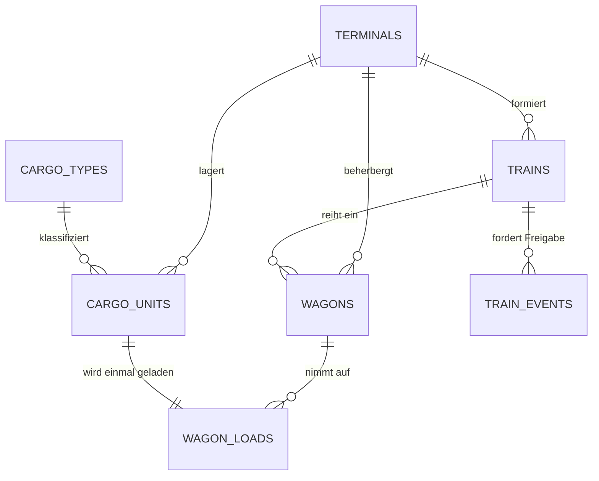
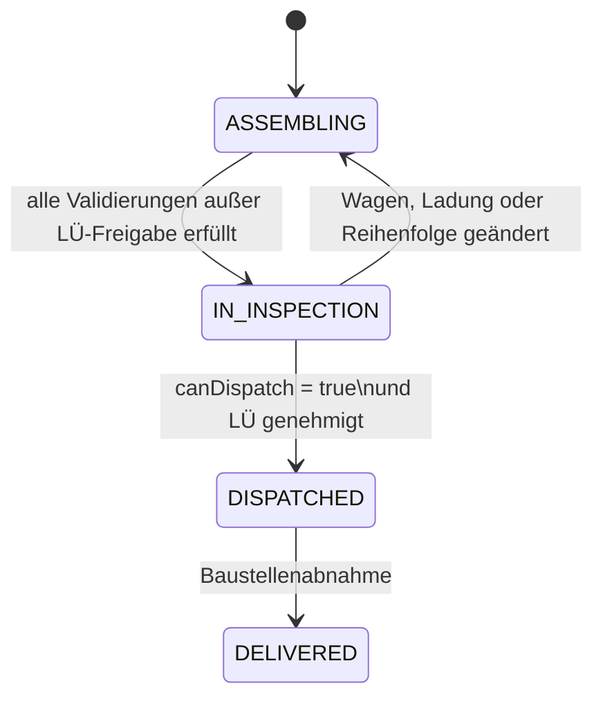

# Technische Architektur: Schwerlast-Terminal-Logistik

**Version:** 1.0  
**Stand:** 27. August 2026  
**Autor:** Manus AI

## 1. Architekturentscheidung

Das Terminalmodul ergänzt den bestehenden React-/Vite-Simulator, ohne dessen aktuelle EVU- und Baugleisdomäne zu duplizieren. Der Client nutzt `src/lib/terminalLogistics.ts` für sofortige Vorschau. Dieselben reinen Funktionen müssen in einer späteren serverseitigen Mutation bzw. Edge Function erneut ausgeführt werden. Erst innerhalb einer Datenbanktransaktion werden Wagenzuordnung, Wagenladung, abgeleitete Zugwerte, LÜ-Ereignis und Zustandswechsel gespeichert. Damit bleibt der Client responsiv, aber nie autoritativ.

> **Single source of truth:** `checkTrainFeasibility` ist die Fachregelquelle. Benutzeroberflächen zeigen nur deren Ergebnis; sie berechnen keine abweichenden Kennzahlen und dürfen keinen Zugstatus direkt auf `DISPATCHED` setzen.

| Schicht | Verantwortlichkeit | Artefakt |
|---|---|---|
| Datenbank | Entitäten, Referenzen, einfache Grenzwerte, eindeutige Zugpositionen und RLS. | `supabase/migrations/20260827140000_schwerlast_terminal_logistics.sql` |
| Domäne | Pure, deterministische Fachregeln für Lager, Kran und Zugbildung. | `src/lib/terminalLogistics.ts` |
| Application Service | Liest Aggregat, ruft Domäne auf, schreibt den validierten Zustand atomar. | Späterer Server-/Edge-Service `dispatchTerminalTrain`. |
| UI | Entwurf, Drag-and-drop, Filter und Statusdarstellung. | Spätere Terminalansichten; keine Geschäftslogik. |
| Tests | Fachregeltests mit unabhängigen Fixture-Daten. | `scripts/testTerminalLogistics.ts` |

Die Migration verwendet `numeric(…, 3)` statt PostgreSQL-`float`, obwohl die Domänentypen Zahlen verwenden. Gewicht, Länge und Fläche sollen in der Persistenz deterministisch und ohne binäre Rundungsartefakte verglichen werden. Der Adapter serialisiert Werte als Zahl oder Dezimalzeichenkette, die Domain rundet Ausgabesummen einheitlich auf drei Nachkommastellen.

## 2. Relationales Datenmodell

| Tabelle | Primärschlüssel | Wesentliche Attribute | Zweck |
|---|---|---|---|
| `terminals` | `id` | `name`, `track_length_meters`, `max_crane_capacity_tons`, `storage_area_sqm`, `current_storage_used`, `has_special_crane` | Repräsentiert das physische Terminal und seine Engpasswerte. |
| `cargo_types` | `id` | `name`, `weight_tons`, `requires_special_crane`, `is_out_of_gauge`, `priority_order_for_construction_site` | Katalog regelrelevanter Frachteigenschaften. |
| `cargo_units` | `id` | `cargo_type_id`, `current_terminal_id`, `storage_area_sqm`, `status` | Physische Partie. Diese Aufteilung verhindert, dass ein Kataloggut mehrfach gleichzeitig geladen wird. |
| `wagons` | `id` | `uic_wagon_type`, `max_payload_tons`, `length_over_buffers_meters`, `current_terminal_id`, `current_train_id`, `position_in_train` | Bestehender Wagenpark, erweitert um die Informationen für einen physisch eingereihten Einzelwagen. |
| `trains` | `id` | `terminal_id`, `destination_construction_site`, `total_length_meters`, `total_weight_tons`, `status`, `is_order_valid` | Formierter Baugleis-Zugverband; `terminal_id` ist für die Gleislängenprüfung nötig. |
| `wagon_loads` | `(wagon_id, cargo_unit_id)` | `loaded_at` | N:M-Zuordnung zwischen Wagen und physischen Frachtpartien. Eine `UNIQUE`-Regel auf `cargo_unit_id` verhindert doppelte Beladung. |
| `train_events` | `id` | `train_id`, `event_type`, `status`, `created_at`, `resolved_at` | Lebenszyklus von Freigaben; enthält den fachlich verlangten Status `LUE_GENEHMIGUNG_ERFORDERLICH`. |



Der im Ausgangsmodell nicht explizit verlangte `terminal_id`-Fremdschlüssel von `trains` ist bewusst ergänzt. Ohne ihn gibt es keine belastbare Zuordnung der maximalen Zuglänge zu einem Terminal. Die bestehende Tabelle `wagons` bleibt aus Kompatibilitätsgründen erhalten. Historische Flottenpakete können weiterhin `count > 1` führen; ein wagenbasierter Zugverband akzeptiert dagegen nur Einzelwagen mit `count = 1`.

## 3. Integritätsregeln und Zuständigkeiten

| Regel | Datenbankabsicherung | Domain-Validierung | Zeitpunkt |
|---|---|---|---|
| Frachtgewicht ist positiv. | `cargo_types.weight_tons > 0` | `INVALID_NUMERIC_VALUE` | Stammdatenpflege und Beladung. |
| Ein Kranhub bleibt innerhalb der Traglast. | Wertgrenze speicherbar, kein zeilenübergreifender Check. | `checkCraneTransfer` mit `CRANE_CAPACITY_EXCEEDED`. | Vor Start des Umschlags. |
| Spezialkran ist verfügbar. | `terminals.has_special_crane`. | `SPECIAL_CRANE_REQUIRED`. | Vor Start des Umschlags. |
| Lager darf nicht überlaufen. | `current_storage_used <= storage_area_sqm`. | `checkStorageAllocation` berechnet Projektion. | Inbound-Transaktion. |
| Wagen ist am Abfahrtsterminal und dem Zug zugeordnet. | Fremdschlüssel. | `WAGON_NOT_AT_TRAIN_TERMINAL`, `WAGON_NOT_ASSIGNED_TO_TRAIN`. | Zugentwurf/Inspektion. |
| Wagenposition ist eindeutig und positiv. | Paar-Check und partieller Unique-Index. | Fehlende bzw. lückenhafte Positionen als fachlicher Fehler. | Jeder Wagenzugriff. |
| Frachtpartie kann nur einmal geladen werden. | `UNIQUE (cargo_unit_id)` in `wagon_loads`. | Doppelte Entwurfszuordnung als Fehler. | Beladungstransaktion. |
| Ladung bleibt unter Wagenzuladung. | Nicht relational ausdrückbar. | Einzel- und Gesamtnutzlastprüfung. | Zugentwurf/Inspektion. |
| Zug bleibt innerhalb Terminalgleislänge. | Denormalisierte Spalte; nicht unmittelbar referenzierbar. | Summe der LÜP gegen `trackLengthMeters`. | Zugentwurf/Inspektion. |
| Baustellenreihenfolge wird eingehalten. | Nicht relational ausdrückbar. | Aufsteigende Güterpriorität entlang der Wagenposition. | Zugentwurf/Inspektion. |
| LÜ-Fracht hat Freigabe. | Ereignistabelle mit klaren Statuswerten. | LÜ-Event wird erzeugt und vor Abfahrt auf `APPROVED` geprüft. | Zugentwurf und Abfahrtsfreigabe. |

## 4. Zustandsautomat

Ein Zug darf nur vom Entwurf über die Inspektion zur Abfahrt gelangen. `DELIVERED` wird vom Baustellenabschluss gesetzt. Die Zugstatus sind absichtlich vom LÜ-Status getrennt: Eine Genehmigung ist ein Event mit eigenem Lebenszyklus und keine unzulässige Erweiterung des Zugstatus-Enums.



| Zugstatus | Erlaubte Änderung | Sperre |
|---|---|---|
| `ASSEMBLING` | Wagen hinzufügen, Position ändern, laden/entladen, Genehmigung beantragen. | Keine Abfahrt. |
| `IN_INSPECTION` | Lesender Prüfbericht; Rückkehr zu `ASSEMBLING` bei Änderung. | Jede mutierende Zugbildungsaktion invalidiert die Inspektion. |
| `DISPATCHED` | Fortschritt, Ankunft und Abrechnung. | Keine Wagen- oder Ladungsänderung. |
| `DELIVERED` | Nur Archiv-/Auswertungsdaten. | Keine operative Mutation. |

## 5. Transaktionale Service-Sequenz

Die nachfolgende Sequenz beschreibt die produktive Implementierung, etwa als Supabase Edge Function oder Node-Backend-Endpunkt. Sie schützt gegen Race Conditions, bei denen zwei Browser denselben Wagen oder dieselbe Frachtpartie reservieren.

1. Der Service sperrt per Transaktion den Zielzug, sein Terminal, alle betroffenen Wagen, Frachtpartien und offenen LÜ-Ereignisse.
2. Er prüft, ob sich der Zug in `ASSEMBLING` oder `IN_INSPECTION` befindet und ob alle Wagen aus `current_terminal_id = trains.terminal_id` stammen.
3. Er ruft `checkTrainFeasibility` mit einem konsistenten Snapshot auf.
4. Bei Fehlern wird die Transaktion ohne Seiteneffekt beendet und die strukturierte Fehlerliste zurückgegeben.
5. Bei LÜ ohne vorhandenes Event wird `train_events(event_type = 'LUE_GENEHMIGUNG_ERFORDERLICH', status = 'OPEN')` angelegt; der Zug verbleibt im Entwurf.
6. Bei Erfolg schreibt der Service ausschließlich `total_length_meters`, `total_weight_tons` und `is_order_valid` aus `trainDerivedFields`. Erst bei vollständig genehmigtem Ergebnis darf er den Zug auf `IN_INSPECTION` bzw. `DISPATCHED` setzen.
7. Das Audit- bzw. Abrechnungssystem erhält anschließend ein unveränderliches Ereignis über die Abfahrt.

> **Wichtig:** Die Domain-Funktion legt keine Datenbankzeilen selbst an. Sie gibt `requiredEvents` zurück. Der Application Service persistiert diese innerhalb derselben Transaktion, damit das UI nie eine kurzfristig widersprüchliche Kombination aus LÜ-Ladung und fehlendem Genehmigungsereignis sieht.

## 6. Implementierte TypeScript-API

Das Modul exportiert exakt die für UI, Backend und Test erforderlichen Typen: `Terminal`, `CargoType`, `CargoUnit`, `Wagon`, `WagonLoad`, `Train`, `TrainEvent` und die Status-Union-Types. Die drei zentralen Funktionen sind rein und deterministisch.

| Funktion | Eingabe | Ausgabe | Produktive Verwendung |
|---|---|---|---|
| `checkStorageAllocation` | Terminal und Frachtflächenbedarf | Projektion, `allowed`, Fehler | Vor Inbound-Buchung. |
| `checkCraneTransfer` | Terminal und Frachttyp | `allowed`, Kran-/Spezialkranfehler | Vor Umschlagbuchung. |
| `checkTrainFeasibility` | Vollständiger Zug-Snapshot | `canDispatch`, Summen, LÜ-Eventbedarf, strukturierte Fehler | Vor Inspektion und vor Abfahrt. |
| `trainDerivedFields` | Ergebnis von `checkTrainFeasibility` | Nur die persistierbaren, abgeleiteten Zugfelder | Server-Transaktion. |

Die Validierungsfehler sind maschinenlesbar über `ValidationCode` und menschenlesbar über `message`. Eine Oberfläche sollte nach `severity` gruppieren, den fehlerhaften `entityId`-Datensatz fokussieren und numerische `details` in einem erklärenden Popover zeigen. Damit bleibt jede Fehlermeldung nicht nur korrekt, sondern handlungsorientiert.

## 7. Ausführung und Qualitätsnachweis

Der Test `scripts/testTerminalLogistics.ts` testet einen zulässigen Standardzug, den LÜ-Genehmigungsfluss, Überlänge, Überladung, falsche Baustellenreihenfolge, Kranüberschreitung und Lagerüberlauf. Er wird über folgenden Befehl ausgeführt:

```bash
npm run test:terminal-logistics
```

Die Migration wird wie die bestehenden Supabase-Migrationen versioniert. Sie sollte erst gegen eine Entwicklungsdatenbank angewendet werden, anschließend mit einem echten Abfahrtsservice verbunden und dann in Staging geprüft werden. Ein Browserclient allein darf die in der Migration dokumentierten Querschnittsregeln nicht freigeben.
