# UI/UX-Architektur: Schwerlast-Terminal-Cockpit

**Version:** 1.0  
**Stand:** 27. August 2026  
**Autor:** Manus AI

## 1. UX-Zielbild

Die Oberfläche muss zwei gegensätzliche Anforderungen verbinden: Das Terminal soll auf einen Blick als lebendiger, zeitkritischer Betrieb verständlich sein; die Zugbildung muss bis zur einzelnen Wagenposition präzise und ohne Informationsverlust funktionieren. Deshalb ist die Oberfläche nicht als 3D-Spielkarte mit versteckten Daten gedacht, sondern als **Operations-Cockpit mit konzentrierter Detailarbeit**.

Die Referenz Frachtimperium trennt Frachtbörse, Disposition, Fuhrpark, Werkstatt, Betriebsgelände und Kartenübersicht in eigene operative Bereiche und setzt bei Frachtlisten auf Auswahl, Filter, Sortierung sowie Wirtschaftlichkeitsprüfung. [1] Das Terminalmodul übernimmt diese bewährte Trennung, ordnet die Navigationsfolge jedoch entlang der eigenen physischen Kette: **Auftragsradar → Inbound → Lager/Kran → Zugbildung → Freigabe → Zugakte**.

> **Zentrale UX-Regel:** Kein kritischer Fehler darf nur am Ende einer langen Zugbildung erscheinen. Jede Wagenkarte, jede Frachtpartie und jeder Slot erklärt direkt, ob und warum sie die Abfahrt sperrt.

| Nutzerfrage | UI-Antwort | Sichtbare Kennzahl |
|---|---|---|
| Was benötigt jetzt Aufmerksamkeit? | Priorisierte Leitstandliste, Ampelstatus und nächste harte Frist. | Liegezeit, Sperrpause, offene Freigaben. |
| Kann ich diesen Auftrag profitabel bedienen? | Auftrags-Drawer mit Ressourcenbedarf und Margenbandbreite. | Erwarteter Deckungsbeitrag, Risiko, benötigte Kapazitäten. |
| Was blockiert den Zug? | Persistente Prüfungsleiste mit fokussierbaren Fehlern. | Fehlercode, Auswirkung und direkter Lösungslink. |
| Welche Reihenfolge braucht die Baustelle? | Bauphasen-Leiste oberhalb des Zuges und Prioritätsmarker an Wagen. | 1…n-Entladesequenz. |
| Ist der Betrieb überlastet? | Terminalkarte mit Auslastungszonen und Konfliktbadges. | Gleislänge, Kranauslastung, Lagerfläche. |

## 2. Informationsarchitektur und Sitemap

Die Hauptnavigation ist auf sieben operative Einträge begrenzt. Das ist bewusst weniger als ein klassisches Managementmenü, damit der Spieler seine Tagesarbeit nicht über mehrere gleichwertige Bereiche verteilt. Für Desktop steht die Navigation in einer permanenten linken Rail; auf Mobilgeräten wandert sie in eine kompakte untere Navigation mit einem kontextuellen „Mehr“-Sheet.

```mermaid
flowchart TD
  A[Leitstand] --> B[Auftragsradar]
  A --> C[Inbound & Ankünfte]
  A --> D[Terminalkarte]
  A --> E[Zugbildung]
  A --> F[Freigaben & Inspektion]
  A --> G[Zugakte & Projekte]
  A --> H[Ausbau & Fuhrpark]

  B --> B1[Spotaufträge]
  B --> B2[Projektabrufe]
  B --> B3[Rahmenverträge]
  C --> C1[Schiffe]
  C --> C2[Frachtflugzeuge]
  C --> C3[Liegeplatz- und Kran-Slots]
  D --> D1[Lagerzonen]
  D --> D2[Krane]
  D --> D3[Baugleise]
  E --> E1[Wagenpool]
  E --> E2[Beladung]
  E --> E3[Reihung]
  F --> F1[LÜ-Genehmigungen]
  F --> F2[Abfahrtscheck]
  G --> G1[Live-Züge]
  G --> G2[Abgerechnete Projekte]
  G --> G3[Ereignisprotokoll]
  H --> H1[Terminalmodule]
  H --> H2[Wagenpark]
  H --> H3[Spezialisten]
```



| Bereich | Primärer Zweck | Standardansicht | Primäre Aktion |
|---|---|---|---|
| Leitstand | Orientierung und Priorisierung. | KPI-Zeile, kritische Liste, Terminal-Miniatur, nächste drei Zeitfenster. | „Problem öffnen“ bzw. „Nächste Aktion“. |
| Auftragsradar | Entscheidungsunterstützung vor Vertragsbindung. | Filterbare Liste; jeder Auftrag mit Marge, Frist, Engpässen und Komplexität. | Auftrag vormerken oder annehmen. |
| Inbound & Ankünfte | Schiffe und Frachtflugzeuge in terminalfähige Fracht überführen. | Zeitachse nach Ankunft/Abfertigung; Kran-/Liegeplatz-Slots. | Slot bzw. Lagerzone zuweisen. |
| Terminalkarte | Physische Engpässe verstehen. | 2D-Plan mit Lagerzonen, Kai, Kran, Baugleisen. | Detailzone öffnen oder Ressource reservieren. |
| Zugbildung | Wagen, Ladung und Reihenfolge korrekt kombinieren. | Drei-Spalten-Editor mit horizontalem Zugband. | Wagen reihen, Fracht zuweisen, Entwurf prüfen. |
| Freigaben & Inspektion | Abfahrtsreife herstellen. | Checkliste offener LÜ-Ereignisse und Inspektionskandidaten. | Genehmigung beantragen / Zug in Inspektion. |
| Zugakte & Projekte | Ergebnis nachvollziehen und den Fortschritt erleben. | Live-Fortschritt, Bauphasen und Abrechnungshistorie. | Projektakte bzw. Baustellenansicht öffnen. |
| Ausbau & Fuhrpark | Langfristige Kapazitätsentscheidungen treffen. | Upgradebaum, Wageninventar, Investitionsvergleich. | Investition planen und bestätigen. |

## 3. Globaler App-Chrome

Der globale Kopfbereich bleibt auf allen Desktopseiten sichtbar und zeigt ausschließlich Informationen, die unmittelbar handlungsrelevant sind: Liquidität, Spielzeit, Terminalauslastung, offene kritische Meldungen und die primäre Abfahrtsfrist. Jeder Statuschip ist anklickbar und führt zur Ursache. Dieses Prinzip knüpft an die in Frachtimperium beschriebenen verlinkten Statusbadges an, reduziert aber die Anzahl zugunsten klarer Priorität. [1]

| Element | Desktop | Mobile | Interaktion |
|---|---|---|---|
| Seitennavigation | Linke Rail, 240 px; Bezeichnung und kritische Zähler. | Untere Leiste mit Leitstand, Radar, Terminal, Zugbildung und Mehr. | Aktiver Bereich immer textlich markiert. |
| Globale Statuszeile | Kopfzeile unter der Hauptnavigation. | Kompakte, horizontal scrollbare Statusleiste. | Jeder Chip öffnet eine gefilterte Problemliste. |
| Primäre Aktion | Seitenabhängiger, klar benannter Button oben rechts. | Fixierte Aktionsleiste über der Bottom-Navigation. | Nie ein generisches „Speichern“; stattdessen etwa „Zug zur Inspektion“. |
| Meldungszentrum | Drawer von rechts. | Bottom Sheet. | Gruppiert nach „blockiert“, „heute“, „Info“. |
| Detailansichten | Kontext-Drawer statt Vollseitenwechsel, wenn kein Workflowwechsel nötig ist. | Vollbild-Sheet mit Zurück-Navigation. | Kontext bleibt erhalten. |

Die visuelle Sprache verwendet dunkles Stahlblau als Grundfläche, neutrale Graphitflächen für Datenbereiche und eine restriktive Statuspalette: Grün für zulässig, Bernstein für Risiko oder Zeitdruck, Rot nur für einen echten Abfahrtsblocker und Violett/Blau für LÜ- oder Genehmigungsstatus. Farbe ist nie das einzige Signal; jedes Badge trägt ein Icon, einen Kurztext und bei Hover bzw. Tap eine Erklärung.

## 4. Leitstand als Einstiegspunkt

Der Leitstand beantwortet das „Was nun?“-Problem, bevor der Spieler in dichte Tabellen wechselt. Er soll keine vollständige Simulation darstellen, sondern die drei nächstwichtigen Entscheidungen sichtbar machen. Ein Auftrag ohne Folgeaktion gehört nicht auf die Startfläche. Die Sortierung ist transparent: erst blockierte Abfahrten, dann harte Fristen, danach wirtschaftliche Chancen mit auslaufendem Angebotsfenster.

```text
┌────────────────────────────────────────────────────────────────────────────────────────┐
│ [Terminal Duisburg-Ruhrort]  10:35  Liquidität 1,24 Mio €  [2 Blocker] [Lager 78 %]    │
├───────────────┬───────────────────────────────────┬────────────────────────────────────┤
│ Navigation    │ HEUTE ENTSCHEIDEND                │ TERMINALÜBERBLICK                  │
│ • Leitstand   │ ┌───────────────────────────────┐ │ Gleis 2: Zug BG-204               │
│ • Aufträge    │ │ 01  LÜ-Freigabe fehlt         │ │  92 / 120 m  [noch 28 m]         │
│ • Inbound     │ │ Zug BG-204 · Sperrpause 18:00 │ │ Kran K2: belegt bis 13:30         │
│ • Terminal    │ │ [Freigabe öffnen]             │ │ Lager Nord: 78 % ████████░░       │
│ • Zugbildung  │ └───────────────────────────────┘ │ Lager Schwerlast: 42 % ████░░░░░░ │
│ • Freigaben   │ ┌───────────────────────────────┐ │                                    │
│ • Projekte    │ │ 02  Schiff „Helios“ ab 12:40  │ │ NÄCHSTE ZEITFENSTER                │
│ • Ausbau      │ │ 240 t Trafogehäuse · Kran K2  │ │ 12:40  Helios · Kai 1              │
│               │ │ [Inbound planen]              │ │ 16:00  Zug BG-204 · Inspektion    │
│               │ └───────────────────────────────┘ │ 18:00  Sperrpause ABS 9            │
└───────────────┴───────────────────────────────────┴────────────────────────────────────┘
```

## 5. Zugbildung: Desktop-Workflow

Die Zugbildung erhält eine fokussierte Arbeitsfläche und keinen modal verschachtelten Tabellenprozess. Sie folgt dem physischen Ablauf von links nach rechts: verfügbare Ressourcen auswählen, auf dem Gleis anordnen, dann prüfen. Das zentrale Zugband wird horizontal dargestellt, weil die tatsächliche Reihung räumlich ist. Die erste Wagenposition entspricht der Baustellenseite und wird dauerhaft markiert. Drag-and-drop ist ein Komfortmechanismus; alle Einreihungsaktionen besitzen zusätzlich zugängliche Tasten „vor“, „zurück“, „an Anfang“ und „an Ende“.

```text
┌────────────────────────────────────────────────────────────────────────────────────────────────────┐
│ Zug BG-204  ·  Baustelle ABS 9 / Abschnitt 3  [Entwurf]    [Entwurf prüfen] [Zur Inspektion →]      │
├──────────────────┬───────────────────────────────────────────┬─────────────────────────────────────┤
│ WAGENPOOL        │ BAUGLEIS 2 — BAUSTELLENSEITE ◄            │ BAUPHASEN & PRÜFUNG                │
│ Suche [________] │ ┌───────┐ ┌───────┐ ┌───────┐             │ 1 Schotter     ● erfüllt           │
│ Filter:          │ │ 01    │ │ 02    │ │ 03    │             │ 2 Schwellen   ● erfüllt            │
│ [Fccs] [Res]     │ │ Fccs  │ │ Rns   │ │ Uaai  │             │ 3 Brücke      ● LÜ genehmigen      │
│ [Uaai] [frei]    │ │ 60/70t│ │ 50/55t│ │100/150│             │                                     │
│                  │ │12.0 m │ │15.0 m │ │24.0 m │             │ 51.0 / 120 m  ████░░░░░░           │
│ Fccs  70 t 12 m  │ │✓ P1   │ │✓ P2   │ │◐ P3   │             │ 210 / 275 t                           │
│ [+ einsetzen]    │ └───────┘ └───────┘ └───────┘             │ Reihenfolge: korrekt                 │
│                  │                                           │ LÜ: Freigabe erforderlich            │
│ Res   60 t 19 m  │ [Wagen hinzufügen] [Vorschau Entladung]   │ [LÜ-Vorgang öffnen]                  │
│ [+ einsetzen]    │                                           │                                     │
├──────────────────┴───────────────────────────────────────────┼─────────────────────────────────────┤
│ Fracht in Wagen 03: [Brückenteil / 100 t / LÜ]       [ändern] │ Blocker: 1 · Warnungen: 0            │
└──────────────────────────────────────────────────────────────┴─────────────────────────────────────┘
```

| Zone | Aufgabe | Interaktionsregel |
|---|---|---|
| Wagenpool | Nur Wagen zeigen, die am Terminal, frei und einsatzfähig sind. | Filterzustand persistiert pro Sitzung; ein Wagen zeigt Zuladung, LÜP, Standort und Einschränkungen. |
| Zugband | Reihenfolge, Wagenlänge und Wagenladung räumlich erfassen. | Jede Änderung löst eine lokalisierte Validierung aus; nie den gesamten Screen blockieren. |
| Ladungsdrawer | Einer Wagenkarte Frachtpartien zuweisen. | Vor Auswahl werden maximales Gewicht, aktuelle Nutzlast und Prioritätskonflikt angezeigt. |
| Bauphasen | Erwartete Entladesequenz aus dem Auftrag sichtbar halten. | Drag auf falsche Position markiert die Auswirkung bereits vor dem Ablegen. |
| Prüfungsleiste | Fehler in Abfahrtsreihenfolge bündeln. | Klick fokussiert Wagen, Fracht oder Genehmigungsprozess; keine unkonkrete „Ungültig“-Meldung. |

Die Validierung wird nicht als Binärflag kommuniziert. Ein Zug kann technisch fit, aber noch nicht genehmigt sein. Die rechte Prüfungsleiste führt deshalb vier explizite Kategorien: **Masse**, **Länge**, **Baustellenreihenfolge** und **Freigaben**. Erst wenn jede Kategorie grün ist, erhält der primäre Button die Abfahrtsaktion; davor führt er immer zum nächsten blockierenden Schritt.

## 6. Mobile-Zugbildung

Ein 1:1-Transfer der Dreispaltenansicht auf Smartphones würde zu horizontaler Überforderung führen. Mobile nutzt daher einen sequenziellen, aber nicht vereinfachten Arbeitsmodus. Es bleibt derselbe Entwurf und dieselbe Validierungsfunktion; ausschließlich die Darstellung wechselt in einen Stepper mit persistentem Gesamtstatus.

```text
┌──────────────────────────────────┐
│ ← Zug BG-204        Entwurf      │
│ 51.0 / 120 m · 1 Blocker          │
├──────────────────────────────────┤
│ [1 Wagen] [2 Ladung] [3 Reihenf.] │
├──────────────────────────────────┤
│ BAUSTELLENSEITE                   │
│ ┌──────────────────────────────┐ │
│ │ 01 · Fccs                    │ │
│ │ Schotter 60/70 t  · 12.0 m   │ │
│ │ P1 ✓                          │ │
│ │ [Position ändern]             │ │
│ └──────────────────────────────┘ │
│ ┌──────────────────────────────┐ │
│ │ 02 · Rns                     │ │
│ │ Gleisschwellen 50/55 t       │ │
│ │ P2 ✓                          │ │
│ └──────────────────────────────┘ │
│ ┌──────────────────────────────┐ │
│ │ 03 · Uaai Tieflader          │ │
│ │ Brückenteil 100/150 t · LÜ   │ │
│ │ P3 · Freigabe fehlt           │ │
│ └──────────────────────────────┘ │
├──────────────────────────────────┤
│ [LÜ-Freigabe öffnen]             │
└──────────────────────────────────┘
```

| Mobiles Muster | Begründung | Konkrete Ausführung |
|---|---|---|
| Kontext-Header | Länge, Gewicht und Blocker dürfen beim Scrollen nicht verschwinden. | Sticky Header mit kompakten Kennzahlen. |
| Stepper statt Spalten | Der enge Bildschirm verlangt klare Teilaufgaben. | Wagen auswählen, Fracht zuweisen und Reihenfolge prüfen; der Fortschritt bleibt reversibel. |
| Karten statt Tabellen | Wagen- und Frachtattribute brauchen lesbare Zeilenhöhen. | Wichtigste drei Attribute sichtbar, Rest über „Details“. |
| Bottom Sheet | Detailentscheidungen dürfen die Zugübersicht nicht verlieren. | Wagenpool, Frachtpartie und Validierungsdetails öffnen als Sheet. |
| Tap-Reihung | Drag-and-drop ist auf Touch fehleranfällig. | „Position ändern“ öffnet eine einfache Zielpositionsliste; Long-press Reorder nur ergänzend. |
| Fixierte Aktion | Der Spieler muss die nächstlogische Aktion jederzeit erreichen. | Kontextbutton: „Nächsten Blocker beheben“, „Entwurf prüfen“ oder „Zur Inspektion“. |

## 7. Kritische Abläufe

### 7.1 Inbound und Kranumschlag

Bei einer eingehenden Schiffsfracht wird nicht sofort eine Animation gestartet. Zuerst zeigt ein „Umschlag bereit?“-Panel Krantragfähigkeit, Spezialkranpflicht, freie Lagerfläche und die Liegegebühr ab dem nächsten Tick. Scheitert ein Wert, ist der Buchungsbutton deaktiviert, während der alternative Lösungsweg sichtbar bleibt: Kran aufrüsten, externen Kran mieten, anderes Terminal wählen oder Auftrag ablehnen. Nach erfolgreichem Umschlag erscheint die Fracht als physische Partie in der passenden Lagerzone und im Zugbildungs-Pool.

### 7.2 LÜ-Genehmigung

LÜ wird als operativer Vorgang behandelt, nicht als einfache rote Warnung. Sobald ein LÜ-Gut in einen Zug geladen wird, erzeugt die Oberfläche eine Genehmigungskarte mit Zug, Gut, Auswirkung auf die Sperrpause und voraussichtlicher Bearbeitungsdauer. Der Nutzer kann den Standardprozess starten oder – sofern freigeschaltet – eine kostenpflichtige Beschleunigung auswählen. Bis `APPROVED` bleibt die Abfahrt klar gesperrt; die restlichen Zugprüfungen dürfen jedoch weiter vorbereitet werden.

### 7.3 Inspektion und Abfahrt

Der Inspektionsscreen ist eine lesende Zusammenfassung, keine zweite Bearbeitungsoberfläche. Er enthält einen Wagenplan, Bauphasen, alle LÜ-Dokumente, Gesamtlänge, Gesamtgewicht und die Sperrpause. Eine Änderung führt sichtbar zurück in den Entwurf und invalidiert die Inspektion. Diese klare Zustandsführung verhindert, dass der Spieler glaubt, ein bereits geprüfter Zug sei trotz nachträglicher Änderung noch freigegeben.

## 8. Komponentenschnitt und State-Architektur

Die bestehende Projektarchitektur definiert `App.tsx` als persistente Mutationsgrenze, während Views nur temporäre Selektions- und Dialogzustände besitzen. Dieses Muster bleibt erhalten. Die künftige UI darf deshalb keine Zugdaten lokal „fertig berechnen“, sondern erhält einen `TerminalTrainSnapshot` und einen `TrainFeasibilityResult` als Props bzw. Query-Ergebnis.

```text
TerminalOperationsView
├─ TerminalKpiStrip
├─ TerminalMapPanel
├─ ArrivalTimeline
└─ CriticalActionsList

TrainFormationView
├─ TrainHeader
├─ WagonPoolPanel
├─ FormationTrack
│  └─ FormationWagonCard
├─ ConstructionPhasePanel
├─ FeasibilityPanel
├─ CargoAssignmentSheet
└─ TrainInspectionModal
```

| Baustein | Eigentümer des UI-Zustands | Datenquelle | Zulässige Mutation |
|---|---|---|---|
| `TerminalOperationsView` | Filter, ausgewählte Zone. | Terminal-, Arrival- und Ressourcen-Snapshot. | Nur Callback für Slot-Vorschau. |
| `TrainFormationView` | ausgewählter Wagen, geöffneter Drawer, Entwurfsreihenfolge. | Zug-Snapshot und Ergebnis von `checkTrainFeasibility`. | Entwurfsmutation über eine zentrale App-/Service-Callback-Grenze. |
| `FeasibilityPanel` | keine berechnende Eigenlogik. | `TrainFeasibilityResult`. | Navigiert zur Fehlerursache. |
| `TrainInspectionModal` | Öffnungszustand und Bestätigungsdialog. | eingefrorener validierter Snapshot. | „In Inspektion“ bzw. „Abfahrt“ über serverseitige Mutation. |

## 9. Performance, Zugänglichkeit und Fehlertoleranz

Die Terminalkarte darf zunächst als performante 2D-Canvas-/SVG-Ansicht entstehen. Sie zeichnet nur Zonen, Gleise und Ressourcenmarker; hochaufgelöste 3D-Modelle sind für die operative Entscheidung nicht erforderlich. Tabellen und Wagenlisten werden bei größeren Beständen virtualisiert. Die Zugbildung arbeitet optimistisch auf einem lokalen Entwurf, debounced die Live-Validierung kurz und fordert vor dem Zustandswechsel zwingend eine serverseitige Neuberechnung an.

| Anforderung | Konkrete Maßnahme |
|---|---|
| Große Wagenbestände | Virtualisierte Listen; stabile IDs; Filter vor Sortierung; keine Neuberechnung in jeder Kartenkomponente. |
| Rechenintensive Prüfung | `checkTrainFeasibility` zentral memoisiert nach Train-/Wagon-/Load-Revision; serverseitig beim Commit wiederholt. |
| Schlechte Verbindung | Lokaler Entwurf bleibt sichtbar, aber der „Zur Inspektion“-Button zeigt Sync-Status und mutiert erst nach Serverbestätigung. |
| Tastaturbedienung | Vollständige Einreihung per Aktionen; Fokusreihenfolge folgt Wagenreihung; keine Drag-only-Interaktion. |
| Screenreader | Wagen nennen Position, Typ, Auslastung, Priorität und Blocker in einem zugänglichen Label. |
| Farbfehlsichtigkeit | Status nutzt Icon + Text + Form; Kontrast mindestens WCAG-AA. |
| Fehlerheilung | Jeder Blocker enthält eine Handlung und führt zu seinem Ursprung; keine Fehlermeldung ohne Lösungsweg. |

## 10. MVP-Reihenfolge

Der erste Implementierungsschritt ist **keine** vollflächige Terminalkarte. Zunächst wird der Zugbildungs-Editor mit Wagenpool, Frachtzuweisung, Reihenfolgenprüfung und LÜ-Panel als End-to-End-Flow gebaut. Erst wenn der Spieler einen Zug von `ASSEMBLING` über `IN_INSPECTION` zur Abfahrt bringen kann, folgt der Inbound-Screen mit Kran- und Lagerzuweisung. Leitstand und Terminalkarte konsumieren anschließend dieselben Daten und verbessern die Orientierung, ohne fachliche Regeln zu duplizieren.

## Referenzen

[1]: https://frachtimperium.de/ "FrachtImperium – Logistik- & Speditions-Browsergame"
[2]: https://www.ubisoft.com/en-gb/game/anno/1800 "Anno 1800 – offizielle Produktseite"

> Die gesamte Quellen- und Referenzbewertung ist in [`RESEARCH_LOGISTICS_GAME_REFERENCES.md`](./RESEARCH_LOGISTICS_GAME_REFERENCES.md) dokumentiert.
