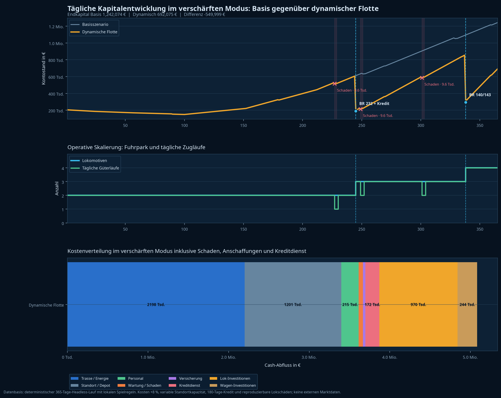

# Jahresauswertung: Verschärfte Wirtschaftslogik im Güterverkehr

> **Ergebnis:** Der 365-Tage-Lauf bleibt im harten Modus zahlungsfähig, aber die kreditfinanzierte Expansion ist im Jahresvergleich nicht mehr liquiditätsoptimal. Das dynamische Szenario endet mit **692.075 €** gegenüber **1.242.074 €** im harten Basisszenario. Nach Abzug der offenen Kreditrestschuld beträgt die dynamische Liquidität **610.144 €**.

## Eingeführte Schwierigkeitsregeln

| Bereich | Neue Regel | Wirkung im Spiel |
| --- | --- | --- |
| Trasse und Energie | Alle Kernkosten für Trasse, Diesel und Strom steigen um 8 %. | Spotverkehre haben weniger Deckungsbeitrag und Kapital wächst langsamer. |
| Standort und Depot | Die Grundmiete deckt 2 Loks und 10 Wageneinheiten. Darüber fallen 620 € je Lok-Stellplatz und 42 € je Wageneinheit pro Tag an; Standgeld bleibt zusätzlich bestehen. | Flottenwachstum erhöht nicht nur die einmalige Beschaffung, sondern dauerhaft die Standortkosten. |
| Kredit | Angebote: 30/60/120/180 Tage zu 6,0/5,5/5,0/4,5 % p.a. | Der laufende Tilgungsdruck steigt deutlich. |
| Bonität | Kredit nur bei Debt-Equity-Ratio nach Auszahlung von höchstens 1,25×. | Cash und eigenfinanzierter Fuhrparkwert begrenzen den Fremdkapitalhebel. |
| Risiken | Ab Level 3 und Tag 90: aktive Lok mit 0,45 % Ausfallwahrscheinlichkeit pro Tag. | Defekte verursachen einen dreitägigen Ausfall und eine fremdvergebene Reparatur mit 60-%-Schadenaufschlag. |

Die Regeln sind lokale Spielannahmen. Sie verwenden keine externen Markt-, Finanzierungs- oder Schadensdaten.[1] [2]

## Ergebnisvergleich im verschärften Modus

| Kennzahl | Basis: harter Modus | Dynamische Flotte: harter Modus | Dynamik gegenüber Basis |
| --- | ---: | ---: | ---: |
| Endkapital | **1.242.074 €** | 692.075 € | **−549.999 €** |
| Kreditbereinigte Liquidität | 1.242.074 € | 610.144 € | **−631.930 €** |
| Erlöse | 3.954.031 € | **5.316.163 €** | +1.362.132 € |
| Cash-Abfluss | 2.921.957 € | 5.084.088 € | +2.162.131 € |
| Güterfahrten | 721 | **870** | +149 |
| Transportleistung | 42.088.800 tkm | **56.991.800 tkm** | +14.903.000 tkm |
| Bewegte Gütermenge | 420.160 t | **518.860 t** | +98.700 t |
| Flotte zum Jahresende | 2 Loks / 10 Wagen | 4 Loks / 28 Wagen | +2 Loks / +18 Wagen |
| Finanzielle Stabilität | Ja | Ja | unverändert |

Die Dynamik liefert weiterhin mehr Umsatz und Transportleistung. Dieser operative Mehrertrag reicht im betrachteten Jahr jedoch nicht aus, um die Mehrbelastung aus Beschaffungen, expandierter Standortkapazität und dem beschleunigten Kreditdienst zu kompensieren.

## Dynamischer Investitionspfad

| Tag | Maßnahme | Kapital vor Maßnahme | Kapital danach | Operative Kapazität |
| ---: | --- | ---: | ---: | --- |
| 245 | 250.000-€-Kredit (180 Tage, 4,5 % p.a.), BR 232, 12 Eanos, zusätzlicher Tf mit Quick-Pay | 605.083 € | 191.233 € | Drei tägliche Güterläufe |
| 338 | BR 140/143, 6 Sggrss, zusätzlicher Tf mit Quick-Pay | 854.249 € | 295.199 € | Vier tägliche Güterläufe |

Gegenüber dem vorherigen, leichteren Modell verschiebt sich die erste Investition von Tag 227 auf Tag 245 und die zweite von Tag 294 auf Tag 338. Die kürzere Restlaufzeit der zusätzlichen Loks begrenzt damit die zusätzlich realisierbare Transportleistung im ersten Simulationsjahr.[2]

## Finanzierung und Kapitalwirkung

| Finanzierung | Betrag |
| --- | ---: |
| Kreditaufnahme | 250.000 € |
| Tilgung im Simulationsjahr | 168.069 € |
| Zinsaufwand im Simulationsjahr | 3.751 € |
| Kreditdienst insgesamt | 171.820 € |
| Offene Kreditrestschuld zum Jahresende | **81.931 €** |
| Endkapital nach Abzug der Restschuld | **610.144 €** |

Der Kredit ist durch die Debt-Equity-Prüfung zugelassen worden. Er verbleibt jedoch nur 120 Tage im operativen Aufbaupfad: Die BR 232 wird an Tag 245 angeschafft. Die beschleunigte Tilgung senkt die Restschuld zum Jahresende, bindet aber im selben Zeitraum deutlich mehr Liquidität als der ehemalige 360-Tage-Kredit.

## Kostenverteilung der dynamischen Flotte

| Kostenblock | Jahreswert | Anteil am Cash-Abfluss |
| --- | ---: | ---: |
| Trasse und Energie | 2.198.376 € | 43,24 % |
| Standort und Depot | 1.200.976 € | 23,62 % |
| Lokinvestitionen | 970.000 € | 19,08 % |
| Wageninvestitionen | 243.600 € | 4,79 % |
| Personal inkl. Einstellung und Quick-Pay | 215.313 € | 4,24 % |
| Kreditdienst (Zins und Tilgung) | 171.820 € | 3,38 % |
| Planmäßige Wartung, Wagenrevisionen und Schäden | 52.978 € | 1,04 % |
| Versicherung | 31.025 € | 0,61 % |

Die dynamischen Standortkosten betragen 1.200.976 €. Das sind 160.726 € mehr als im früheren reinen Fixkostenmodell der dynamischen Flotte. Der Kreditdienst steigt gegenüber dem früheren langen Darlehen von 99.246 € auf 171.820 €.[3]

## Reproduzierbare Schadenereignisse

| Tag | Baureihe | Defekt | Reparatur | Stillstand | Ausgefallene Güterläufe |
| ---: | --- | --- | ---: | ---: | ---: |
| 227 | BR 218 | Bremse | 9.600 € | 3 Tage | 3 |
| 249 | BR 218 | Antrieb | 9.600 € | 3 Tage | 3 |
| 301 | BR 218 | Bremse | 9.600 € | 3 Tage | 3 |
| **Summe** |  |  | **28.800 €** | **9 Tage** | **9** |

Der Lauf verwendet den fest hinterlegten Pseudozufalls-Seed `1592598566`. Somit sind Eintrittstage, Defektarten, Reparaturkosten und Stillstände für diesen Startzustand exakt reproduzierbar. In der Live-Anwendung verwendet das Ereignismodul echte Zufallsziehungen; dort ist die Ereignisfolge absichtlich nicht festgeschrieben.[2]

## Einordnung und Grenzen

| Offenlegung | Festlegung |
| --- | --- |
| **Basis** | Cash-basierte Managementrechnung: Erlöse, Trasse/Energie, Standort, Personal, Wartung, Schäden, Investitionen, Zinsen und Tilgung. Fuhrparkwerte werden nicht als Verkaufserlös realisiert. |
| **Zeit** | 365 virtuelle Tage ab Starterunternehmen; ausgewertet nach Abschluss des Jahreslaufs. |
| **Annahmen** | Kostenaufschlag 8 %, Grundkapazität 2 Loks/10 Wagen, zusätzliche Standortkosten, Debt-Equity-Limit 1,25×, Kredit 180 Tage/4,5 % p.a., fixer Risiko-Seed. |
| **Quellen und Confidence** | Alle Eingaben stammen aus den lokalen TypeScript-Regeln und den erzeugten JSON/CSV-Ausgaben.[1] [2] Die Daten sind für dieses Szenario exakt reproduzierbar. Sie sind keine Prognose für reale EVU-Kosten, Schadensquoten, Vertragsauslastungen oder Kreditzinsen. |
| **Compliance** | Dies ist die Auswertung einer Spielsimulation und keine persönliche Finanzberatung. |

## References

[1]: ../src/lib/operatingCosts.ts "Lokale Trassen- und Energieformeln"
[2]: runDynamicFreightYear365.ts "Dynamischer 365-Tage-Headless-Lauf"
[3]: output/dynamic-freight-year-365.json "Ergebnisdaten des verschärften dynamischen Laufs"
