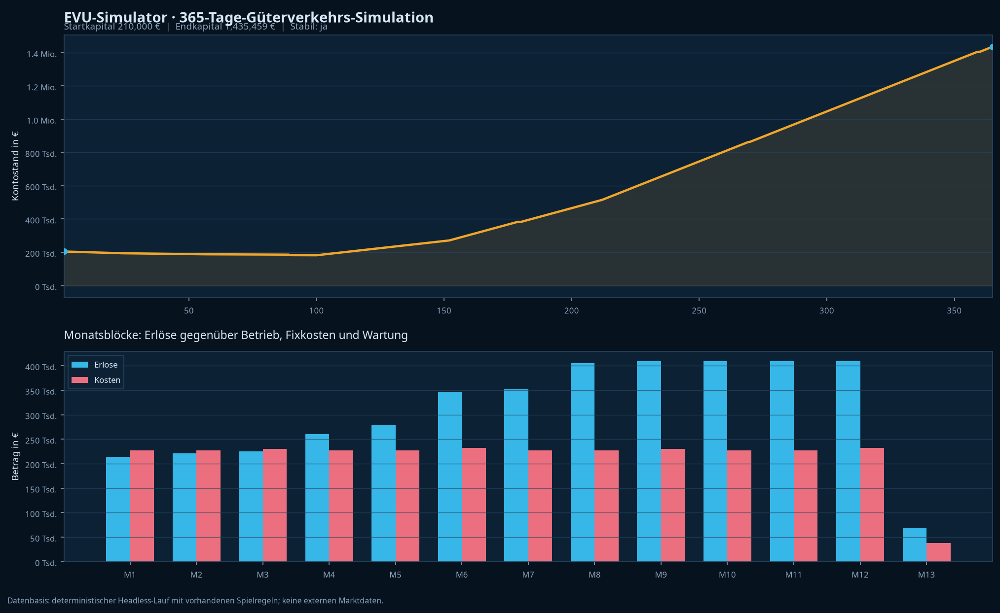

# Jahresbericht: 365-Tage-Headless-Simulation Güterverkehr

> **Ergebnis:** Der geprüfte Starterbetrieb bleibt über den vollständigen virtuellen Jahreslauf finanziell stabil. Der Kontostand fällt zu keinem Zeitpunkt unter 0 € und endet bei **1.435.459 €**.



## Kennzahlen auf einen Blick

| Kennzahl | Ergebnis |
| --- | ---: |
| Simulationszeitraum | 365 virtuelle Tage |
| Startkapital | 210.000 € |
| Endkapital | 1.435.459 € |
| Netto-Cash-Veränderung | **+1.225.459 €** |
| Niedrigster Kontostand | 182.382 € |
| Erster negativer Tag | Kein negativer Tag |
| Finanzielle Stabilität | **Ja** |
| Erlöse | 4.005.169 € |
| Gesamtkosten | 2.779.710 € |
| Ergebnis nach allen angesetzten Kosten | **+1.225.459 €** |
| Erlös-/Kosten-Deckung | 144,08 % |
| Operative Cash-Marge | 30,59 % |
| Finaler EVU-Level / Bekanntheit | Level 7 / 48 |

Die vollständigen Rohwerte und die tägliche Zeitreihe sind als JSON- und CSV-Artefakt abgelegt.[1] [2]

## Güterverkehr und Erlösbasis

| Verkehrskennzahl | Ergebnis |
| --- | ---: |
| Abgeschlossene Güterfahrten | 730 |
| Rahmenvertragsläufe | 365 |
| Eanos-Spotläufe | 365 |
| Erneuerungen des Coil-Rahmenvertrags | 18 |
| Beförderte Gütermenge | 423.400 t |
| Transportvolumen | 42.267.000 tkm |
| Rahmenvertragserlöse | 1.670.260 € |
| Spoterlöse | 2.334.909 € |

Der Eanos-Spotverkehr trägt mit **58,29 %** der Erlöse den größeren Umsatzanteil. Der Coil-Rahmenvertrag liefert **41,70 %** und stabilisiert den täglichen Grundbetrieb. Die Erlöse steigen im Jahresverlauf, weil die Simulation nach jeder Fahrt die vorhandene XP- und Stufenlogik anwendet; der finale Level 7 erhöht damit die bestehende Erlösmultiplikatorbasis.[3]

## Kosten- und Ergebnisrechnung

| Kostenblock | Betrag | Anteil an Gesamtkosten |
| --- | ---: | ---: |
| Trasse und Energie | 1.501.245 € | 54,00 % |
| Standort, Halle und Standgeld | 1.040.250 € | 37,42 % |
| Personalgehälter | 185.420 € | 6,67 % |
| Versicherungsgrundpauschale | 31.025 € | 1,12 % |
| BR-218-Fristarbeiten | 12.000 € | 0,43 % |
| Wagenrevisionen | 5.120 € | 0,18 % |
| Quick-Pay-Nachschulung | 2.200 € | 0,08 % |
| Einstellungskosten | 2.450 € | 0,09 % |
| **Gesamtkosten** | **2.779.710 €** | **100,00 %** |

Der laufende Betrieb erwirtschaftet vor fixen Kosten, Personal und Wartung einen Deckungsbeitrag von **2.503.924 €**. Nach allen im Szenario angesetzten Kosten verbleiben **1.225.459 €**, entsprechend durchschnittlich **3.357,42 € Tagesüberschuss**. Die durchschnittlichen Tageserlöse von 10.973,06 € übersteigen die Tageskosten von 7.615,64 €.[1]

## Baureihen- und Wartungsanalyse

| Baureihe / Zuglauf | Jahresbeitrag vor Fixkosten | Einordnung |
| --- | ---: | --- |
| **BR 218** – gesamt | **2.503.924 €** | Einzige im Starter-Szenario eingesetzte und damit vergleichbare Baureihe. |
| BR 218 · Eanos-Spotverkehr | 1.283.709 € | Höchster Zuglaufbeitrag. |
| BR 218 · Coil-Rahmenvertrag | 1.220.215 € | Stabiler, geringfügig niedrigerer Zuglaufbeitrag. |

Für beide BR 218 wurden jeweils an den Tagen 90, 180, 270 und 360 vorsorgliche F-Fristarbeiten als externe Werkstattleistung angesetzt. Das ergibt **8 planmäßige Arbeiten** zu jeweils **1.500 €**, zusammen 12.000 €. Zusätzlich laufen an den Tagen 180 und 360 jeweils zwei Wagenrevisionen, insgesamt **4 Wagenrevisionen** zu je 1.280 €.[4] [5]

## Personal und Wagenprüfer-Abgrenzung

Am ersten Tag stellt der Lauf einen zusätzlichen Tf Rang 1 ein und bucht die vorhandene Quick-Pay-Gebühr für eine fehlende Baureihenfreigabe. Die Personalbasis enthält außerdem einen Wagenprüfer Rang 1; dessen kanonisches Monatsgehalt ist in den Gehaltskosten enthalten.[6] Der aktuelle Runtime-Code enthält jedoch keine eigenständige Dispositions- oder Preisregel für Wagenprüfer-Einsätze. Deshalb bildet der Lauf **keine erfundene Einsatzpauschale** ab, sondern bucht ausschließlich die vorhandenen Wagenfristarbeiten über die kanonischen Revisionsraten.[5]

## Modellbasis, Zeitbezug und Grenzen

| Offenlegung | Festlegung |
| --- | --- |
| **Basis** | Cash-basierte Managementrechnung: Frachterlöse minus operative Kosten, Gehälter, Standort, Versicherungen und planmäßige Wartung. Keine Steuer-, Abschreibungs- oder Forderungslogik. |
| **Zeit** | 365 virtuelle Tage ab dem Starterzustand bei Tick 0. |
| **Annahmen** | Zwei tägliche Güterläufe mit Starter-BR-218 und Starterwagen; Coil-Rahmenvertrag wird bei Ablauf erneuert; Eanos-Spotlauf folgt dem Profil des vorhandenen Starterauftrags. Keine Kredite, Leasingverträge, Werbung, Baugleis-Einsätze oder Zufallsereignisse. |
| **Quellen und Confidence** | Alle Beträge stammen aus dem lokalen Regelwerk und dem mitgelieferten, reproduzierbaren Lauf. Der zweite Lauf erzeugte identische SHA-256-Prüfsummen für JSON und CSV. Die Aussagekraft ist **hoch für das dokumentierte Basisszenario**, aber nicht für zufällige Schäden, andere Flotten, zusätzliche Kredite oder alternative Dispositionen. |
| **Compliance** | Dies ist eine Analyse einer Spielsimulation und keine persönliche Finanzberatung. |

## Reproduzieren

```bash
cd /home/ubuntu/evu-work/EVU-Simulator
./node_modules/.bin/tsx --tsconfig tsconfig.app.json simulation/runFreightYear365.ts
python3 simulation/renderYear365Chart.py
```

## References

[1]: output/freight-year-365.json "Finale Kennzahlen des Headless-Jahreslaufs"
[2]: output/freight-year-365-daily.csv "Tägliche Kennzahlen des Headless-Jahreslaufs"
[3]: ../src/lib/orderMarket.ts "Frachterlös- und Stufenmultiplikator"
[4]: ../src/lib/workshop.ts "F-Frist und Werkstattquote"
[5]: ../src/lib/wagonJobs.ts "Wagenrevision und Fristkosten"
[6]: ../src/lib/personal.ts "Quick-Pay-Nachschulung" 
